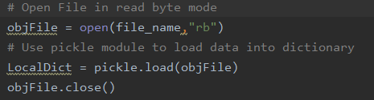
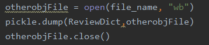
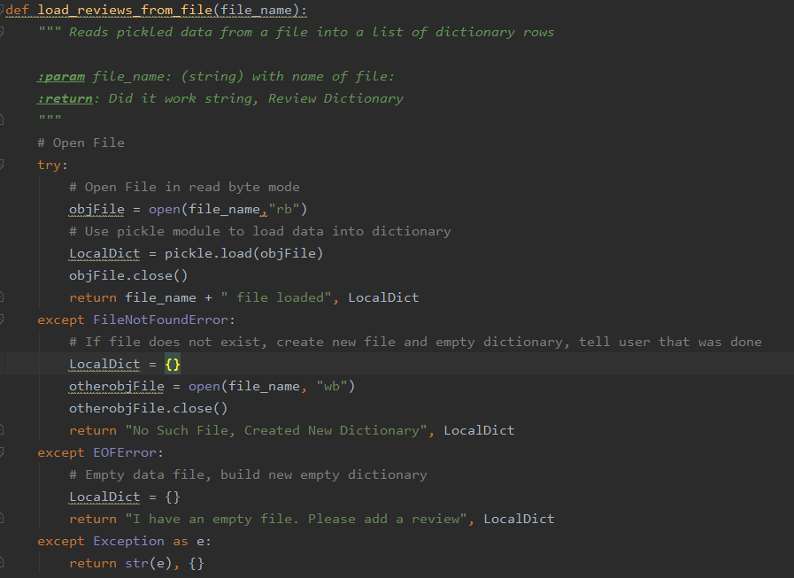
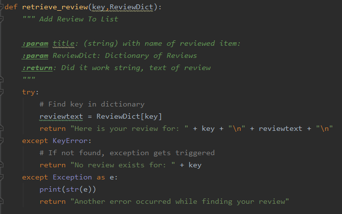
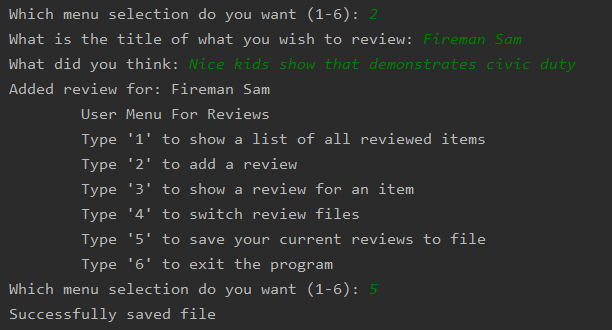
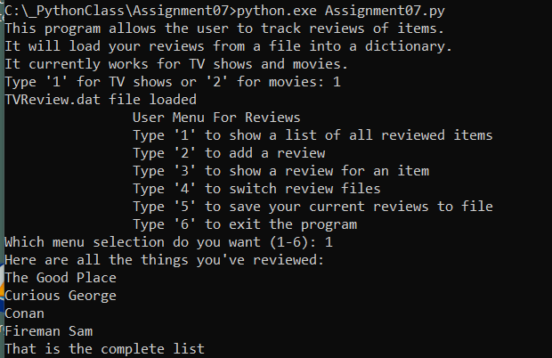
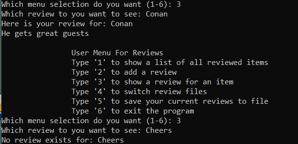
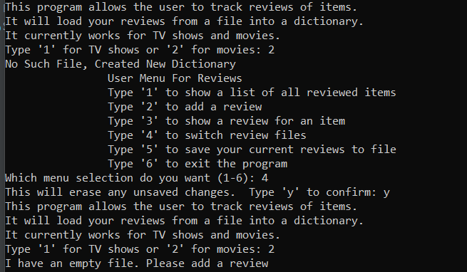
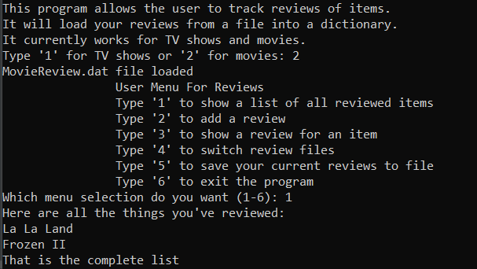

Keith Burdette  
March 6th, 2020  
Foundations of Programming: Python  
Assignment 07  
[Git Hub Link](https://github.com/twkeith/IntroToProg-Python-Mod07)

# Using Python Pickling and Exception Handling

## INTRODUCTION

This assignment asked us to demonstrate the concepts of pickling and exception handling in python.  These two concepts fit nicely along with the list and file manipulation tools we have used the past couple assignments.  To integrate these ideas, I created a program that tracks reviews of things in dictionaries.

## PICKLING

While I loathe eating pickles, using the pickle function in python I found an enjoyable experience.  Most of the file writing we have done has involved converting more complex data structures into strings and writing them line by line into a text file.  When the file needs to get loaded back into python, we have need to process the text as strings and then bring it back into whatever format (ie. dictionary or two-dimensional list) it had originally been in.  Instead of writing to the files strictly as text, pickling converts your data into bytes to write to a file.  The following website offers a good explanation of the function and capabilities of pickling:

[Python Central](https://www.pythoncentral.io/how-to-pickle-unpickle-tutorial/)

Pickling uses two basic operations: a load to get data from a file and a dump to save data to a file.  These two functions can be used after open file functions with the only difference being the mode the file needs to be opened in.  To write text, we have used “w”, “r” or “a” flags to open the file in write, read or append mode.  When pickling, we need to use “wb”, “rb” or “ab” flags to open in write bytes, read bytes or append bytes mode.

My review collecting program uses a very similar format to the last assignment we used for ToDo lists.  I created presentation functions that display information to the user and collects the various inputs needed.  I also created processing functions that process the files and dictionaries.  In the data load function, I had a file_name parameter that opens the file in “rb” mode then uses the pickle load function to retrieve the data.  This is shown in Figure 1.  Similarly, the save function opens the file in “wb” mode and uses the pickle dump function to write back to the file.  This is shown in Figure 2.

  
<em>Figure 1 – Pickle.Load Example</em>

   
<em>Figure 2 – Pickle.Dump Example</em>

## EXCEPTION HANDLING

If a python program runs into a problem, certain types of errors cause the program to exit in an uncontrolled manner.  For instance, if code tries to divide by zero, the program quits and displays an unfriendly message to the user.  Using exception handling, we can account for conditions that would otherwise crash the program and keep it running.  Try/Except blocks can be used to implement this; put the code that might crash into the try block then in the paired except block execute code in case things go wrong.  Multiple except blocks can be stacked with different types of exceptions in case different things go wrong.  I found the following website to be useful when explaining the concept of exception handling:

[Data Camp](https://www.datacamp.com/community/tutorials/exception-handling-python)

In my review collecting program, I used exception handling in two places to keep the program running to account for errors.  The first use was in the same load function where I used the pickling method I mentioned earlier.  If python tries to load a file that doesn’t exist, an error happens.  If I put my open file statement within a try block, I can set an except block with a FileNotFoundError exception that will execute if there is no file.  For my review program, in the FileNotFoundError exception block, I create the file with an open file function in write mode.  While testing, I found that pickling caused an error when trying to pickle load an empty file.  That tripped an EOFError so I created another exception block where I put code to return an empty dictionary.  This whole function is shown in Figure 3.

   
<em>Figure 3 – Load From File Function</em>

My second use of exception handling came in the function where I return the text of a review for a specific item.  Dictionaries have their own set of exceptions like the KeyError I used.  If I try to return the value of a key that doesn’t exist in the dictionary, this error is returned.  In my exception block, I return a default statement that tells the user that the item they are trying to see the review for wasn’t found.  This function is shown in figure 4.

   
<em>Figure 4 – Retrieve Review Function</em>

## TESTING THE CODE

Running the program, we test the pickling functions right at the start.  After picking the type of review you want to view, you can show all the items from that review file with option choice 1.  This is Figure 5.

  
<em>Figure 5 – Initial File Load, Shows Items Loaded</em>

Next, I will add a record to the dictionary then save it to file to demonstrate the pickle dump function.  This is Figure 6.

  
<em>Figure 6 – Saving a File</em>

I will switch to command line to show that my file save was successful.  This is Figure 7.

  
<em>Figure 7 – Load File from Command Line</em>

Now to demonstrate the exception handling.  First in the dictionaries with menu option 3.  Figure 8 shows first a successful find in the dictionary then shows an unsuccessful choice that triggers the KeyError exception.

   
<em>Figure 8 – Dictionary Exceptions</em>

Now to test the file loading exceptions.  No movie review file exists as of run time so when I try to load it.  I will get an error and create the file.  If I then try to load the file again, I’ll get the file empty error.  This is shown in Figure 9.

  
<em>Figure 9 – FileNotFound and EOF Exception Examples</em>

I added a couple reviews to the movie file and saved.  Then I reloaded the file and printed all the reviewed items in the second dictionary.  This is shown in Figure 10.

  
<em>Figure 10 – Reloading a file, printing keys from Dictionary</em>

## SUMMARY

This assignment showcased two parts of python code: exception handling and pickling.  Instead of using for loops to parse lists of texts to and from files, pickling enables users to preserve the data structure of a python element by converting it to bytes.  One line of code can accomplish most load and save file tasks.  Many sites including the PythonCentral site I linked above warn that pickling doesn’t have any defense against malicious code.  They advise that users only unpickle things from trusted sources.
Predicting how users might break a program, coders can use exception handling to create safeguards that keep programs from crashing.  Putting statements in a try/except block gives the ability execute alternate code if something goes wrong in the main block.  At the base level, an exception can be set to grab all errors and give the users a generic message.  Specific exceptions can be set however that do different things based on how the code breaks.  Using this concept can make a seamless experience for end users and direct them to make appropriate choices for the program.
